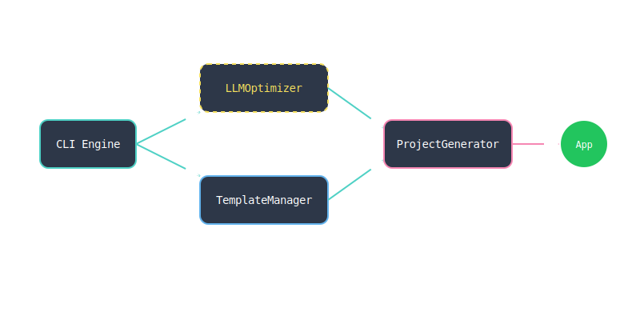

<div align="center">
  
  
  <br />
  <br />

  <h1>✨ AgentForge</h1>
  <p><b>Autonomous Full-Stack App Builder</b></p>
  <i>Scaffold premium, containerized full-stack applications at the speed of thought.</i>

  <br />
  <br />

  [](https://typescriptlang.org)
  [](https://github.com/shenald-dev)
  [](https://docker.com)
  [](https://openrouter.ai)
  
  <br />

  <a href="https://agentforge-demo-shenald-dev.vercel.app/"><b>Check out a live generated Next.js App Demo</b></a>
</div>

---

## 🌊 Flow State Initiated

**AgentForge** is a CLI orchestrator designed for Senior Engineers and Vibe Coders. Rather than spending three hours manually wiring up Next.js to FastAPI, configuring Docker Compose, and fighting with GitHub Actions—AgentForge handles it entirely.

Simply provide a short natural language idea, and AgentForge will instantly scaffold a complete web application—complete with strict TypeScript frontends, high-performance backends, full CI/CD pipelines, and optional LLM-refined documentation.

## 🚀 Features

- **⚡ Instant Scaffolding**: Generate `SaaS`, `Landing+API`, or `Realtime` project templates instantly.
- **🐳 Zero-Config Previews**: The built-in `agentforge preview .` command cleanly manages background `docker-compose` orchestration locally.
- **🧠 Optional LLM Vibe Pass**: If an `OPENROUTER_API_KEY` is present, AgentForge automatically refines the generated project docs using powerful free models (e.g., `arcee-ai/trinity-large-preview:free`) to strictly match your unique idea.
- **🛡️ Clean Architecture**: Emitting only modern, strict-typed boilerplate (`Next.js`, `FastAPI`, `Zod`, `Socket.io`).

## 🛠️ Quick Start

### 1. Install Globally
```bash
npm install -g agentforge
```

### 2. Scaffold a New App
```bash
agentforge create "A high conversion real estate landing page"
```
*The CLI will guide you through picking a template (SaaS, Landing+API, Realtime) and generate the entire boilerplate.*

### 3. Spin up the Result
Navigate to your new project and let AgentForge orchestrate the Docker containers:
```bash
cd my-new-app
agentforge preview .
```
- **Frontend** will be live on `http://localhost:3000`
- **Backend API/Socket** will be live on `http://localhost:8000`

---

## 🏗️ Architecture Under the Hood

AgentForge uses a dynamic, modular **Template Manager** hooked into **Handlebars** compilation. It recursively parses embedded template directories to dynamically inject your project tokens and LLM enhancements.

- **Frontend**: Next.js 14, React 18, Tailwind CSS
- **Backend**: FastAPI (Python) or Express/Socket.io (Node)
- **Tooling**: Biome, ESLint, TypeScript 5+

## ⌨️ Advanced Usage & LLM Tweaks

Want AgentForge to natively re-write the READMEs and configurations of the projects it generates based on your idea?
Simply export an OpenRouter API key before running the CLI:

```bash
export OPENROUTER_API_KEY="sk-or-v1-..."
agentforge create "A minimalistic deep-work pomodoro timer"
```
AgentForge uses Langchain under the hood to ingest your text and manipulate the Handlebars parsing logic in real-time.

## 🤝 Contributing

Want to add a brilliant new Template to the Forge? Let's flow!
Check out the [CONTRIBUTING.md](./CONTRIBUTING.md) guide.

- 🐛 **Found a bug?** Open an issue to let us know.
- ✨ **Have a feature idea?** We are open to PRs! Just make sure to run `npm run test` and `npm run lint`.
- 🎨 **Documentation tweaks?** Always welcome!

---
> *Built by a Vibe Coder. Forget the config, just build.*
