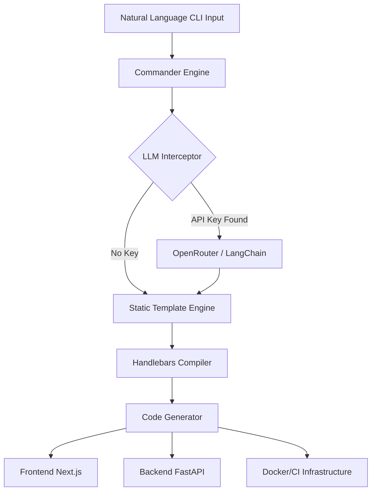

<div align="center">
  
  
  <br />

  <h1>✨ AgentForge</h1>
  <p><b>Autonomous Full-Stack App Builder</b></p>
  <i>Scaffold premium, containerized full-stack applications at the speed of thought.</i>

  <br />
  <br />

  [](https://typescriptlang.org)
  [](https://github.com/shenald-dev)
  [](https://docker.com)
  [](https://openrouter.ai)
  [](LICENSE)
  
  <br />

  <a href="https://frontend-sooty-xi-69.vercel.app"><b>Check out a live generated Next.js App Demo</b></a>
</div>

---

## 📑 Table of Contents
- [🌊 Flow State Initiated](#-flow-state-initiated)
- [🚀 Enterprise Features](#-enterprise-features)
- [🏗️ System Architecture](#️-system-architecture)
- [🛠️ Installation & Setup](#️-installation--setup)
- [💻 Comprehensive Usage](#-comprehensive-usage)
- [🧩 The Templates](#-the-templates)
- [⌨️ Advanced LLM Integration](#️-advanced-llm-integration)
- [⚠️ Troubleshooting & FAQ](#️-troubleshooting--faq)
- [🤝 Contributing](#-contributing)

---

## 🌊 Flow State Initiated

**AgentForge** is an advanced CLI orchestrator explicitly designed for Senior Engineers, Vibe Coders, and architectural designers. Rather than spending hours manually wiring up Next.js to FastAPI, debugging Docker Compose networking, and fighting with GitHub Actions boilerplate—AgentForge handles it entirely in seconds.

Simply provide a short natural language idea, and AgentForge will instantly scaffold a complete web application—complete with strict TypeScript frontends, high-performance backends, full CI/CD deployment pipelines, and optional LLM-refined documentation.

---

## 🚀 Enterprise Features

- **⚡ Instant Scaffolding**: Generate premium, production-ready `SaaS`, `Landing+API`, or `Realtime` project templates instantly.
- **🐳 Zero-Config Previews**: The built-in `agentforge preview .` command cleanly manages background `docker-compose` orchestration locally.
- **🧠 Optional LLM Vibe Pass**: If an `OPENROUTER_API_KEY` is present, AgentForge automatically refines the generated project docs and internal configuration using powerful free models to strictly match your unique idea.
- **🛡️ Clean Architecture**: Emitting only modern, strict-typed boilerplate (`Next.js 14`, `FastAPI`, `Zod`, `Socket.io`, `Express`).
- **🌐 Vercel-Ready**: Native `vercel.json` edge routing injected automatically to prevent 404 deployment drops.
- **🔄 CI/CD Automated**: Ships with pre-configured GitHub Action pipelines for testing and deployment.

---

## 🏗️ System Architecture

AgentForge uses a dynamic, modular **Template Manager** hooked into **Handlebars** compilation and AI generation.



1. **The CLI Orchestrator**: `Commander` traps the user input and extracts the natural language intent.
2. **The Generator Core**: The system recursively parses the selected embedded template directory (`/templates`).
3. **Token Injection**: Variables like `{{projectName}}` and `{{author}}` are dynamically injected into file names and file contents.
4. **Vercel Overrides**: A `vercel.json` file is enforced instructing edge platforms on how to natively route.

---

## 🛠️ Installation & Setup

### 1. Install Globally (Recommended)
The fastest way to get started is to install AgentForge globally on your machine:
```bash
npm install -g agentforge
```

### 2. Run via NPX
If you prefer not to install globally, you can execute it dynamically without permanently altering your system:
```bash
npx agentforge create "My awesome idea"
```

### 3. Build from Source
For contributors and advanced users:
```bash
git clone https://github.com/shenald-dev/agentforge.git
cd agentforge
npm install
npm run build
npm link
```

---

## 💻 Comprehensive Usage

### Scaffold a New App
```bash
agentforge create "A high conversion real estate landing page"
```
*The interactive CLI will guide you through picking a template and generating the boilerplate.*

### Spin up the Local Containers
Navigate to your new project and let AgentForge orchestrate the isolated Docker environment:
```bash
cd my-new-app
agentforge preview .
```
- **Frontend Container** mapped to `http://localhost:3000`
- **Backend API/Socket Container** mapped to `http://localhost:8000`

---

## 🧩 The Templates

AgentForge ships with three distinct boilerplate engines designed for different product architectures.

### 1. The `saas` Template
**Best for:** Complex web applications requiring user state, database interactions, and heavy backend processing.
- **Frontend**: Next.js 14 App Router, React 18, Tailwind CSS, Lucide Icons.
- **Backend**: Python FastAPI, strictly typed Pydantic models, uvicorn high-performance server.
- **Infrastructure**: Isolated multi-container `docker-compose.yml`.

### 2. The `landing-api` Template
**Best for:** Marketing sites, micro-startups, and lightweight API wrappers.
- **Frontend**: Next.js 14 App Router optimized for static/edge delivery.
- **Backend**: Lightweight Node.js Express server + CORS middleware via TypeScript.
- **Infrastructure**: Multi-container docker stack.

### 3. The `realtime` Template
**Best for:** Chat apps, live-dashboards, multiplayer games.
- **Frontend**: Next.js 14 connected natively to Socket.io client instances.
- **Backend**: Node.js WebSocket engine using `socket.io`.
- **Infrastructure**: Dockerized WS pass-through architecture.

---

## ⌨️ Advanced LLM Integration

AgentForge includes an optional **AI Enhancement Pass**. It uses `Langchain` under the hood to ingest your text and manipulate the Handlebars parsing logic in real-time to generate a custom `README.md` perfectly matching your prompt's intent.

To enable this, we use the **OpenRouter API**, allowing us to tap into hundreds of models.

### 1. Setup the Environment Variable
Export your OpenRouter key:
```bash
# Windows (PowerShell)
$env:OPENROUTER_API_KEY="sk-or-v1-..."

# Linux / MacOS
export OPENROUTER_API_KEY="sk-or-v1-..."
```

### 2. Run the Generation
```bash
agentforge create "A minimalistic deep-work pomodoro timer focusing on flow state"
```
AgentForge natively detects the API key, bridges into the `LLMOptimizer` singleton, and intelligently rewrites the documentation specifically for a Pomodoro application instead of a generic boilerplate.

---

## ⚠️ Troubleshooting & FAQ

**Q: My Vercel deployment is returning a 404 NOT FOUND error?**  
**A:** This usually happens if the project wasn't detected as Next.js. Ensure the `vercel.json` file generated in the `frontend` folder explicitly states `"framework": "nextjs"`.

**Q: Docker compose is failing to bind ports?**  
**A:** Ensure you don't have other services running locally on `3000` or `8000`. You can edit the `docker-compose.yml` natively mapped ports to bypass this.

**Q: The CLI crashes missing Handlebars files?**  
**A:** Ensure you are running `npm run build` if building from source. The `dist` directory must contain the compiled JavaScript and the copied `templates` directory.

---

## 🤝 Contributing

Want to add a brilliant new Template to the Forge? Let's flow!
Check out the [CONTRIBUTING.md](./CONTRIBUTING.md) guide.

- 🐛 **Found a bug?** Open an issue to let us know.
- ✨ **Have a feature idea?** We are open to PRs! Just make sure to run `npm run test` and `npm run lint`.
- 🎨 **Documentation tweaks?** Always welcome!

---
> *Built by a Vibe Coder. Forget the config, just build.*
